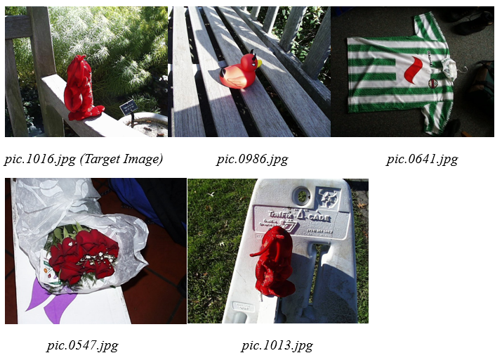
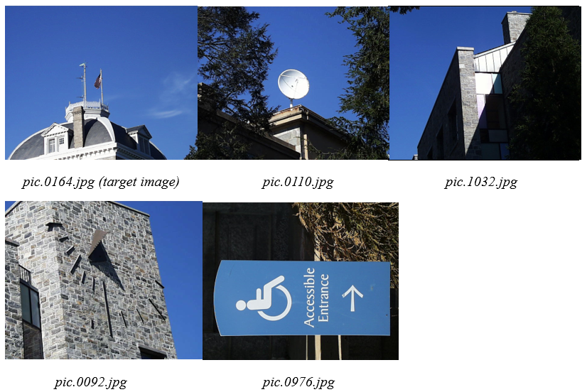
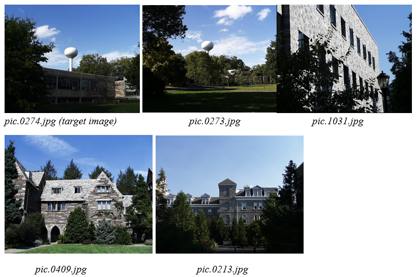
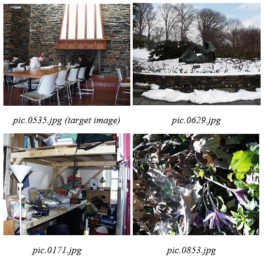
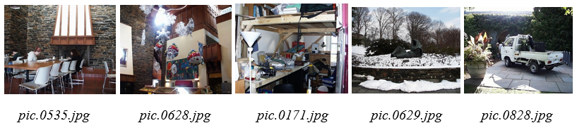
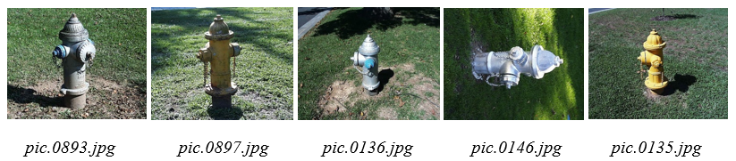
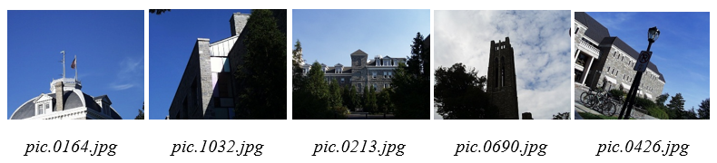
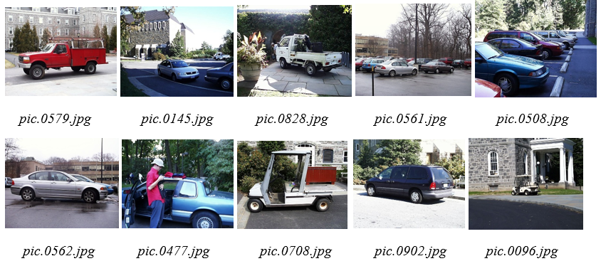

# CS5330: Content-Based Image Retrieval

**Course:** Pattern Recognition and Computer Vision  
**Tech:** C++ · OpenCV · ResNet18 · C++17 Filesystem · Olympus Image Database

---

## Overview

A comprehensive Content-Based Image Retrieval (CBIR) system that finds visually similar images from a 1,106-image database. Given a target image, the system computes visual features and returns the top N most similar matches using six different matching methods — progressing from simple pixel-level comparison all the way to deep learning semantic embeddings.

The system follows a **two-program architecture**: Program 1 pre-extracts features from the entire database and saves them to CSV files. Program 2 reads a target image, computes its features, and returns ranked results — making queries fast without re-processing the database each time.

---

## Matching Methods

| # | Method | Features | Distance Metric |
|---|--------|----------|----------------|
| 1 | Baseline | 7×7 center pixel region | Sum-of-squared difference |
| 2 | Color Histogram | 8×8×8 RGB histogram (whole image) | Histogram intersection |
| 3 | Multi-Region Histogram | Separate top/bottom half histograms | Histogram intersection |
| 4 | Color + Texture | RGB histogram + gradient magnitude | Equal-weighted combination |
| Ext | Color + Texture + Orientation | Task 4 + gradient orientation (8 bins) + Laws filters (80 bins) | Equal-weighted combination |
| 5 | ResNet18 Embeddings | 512-dim global average pooling vector | Cosine distance |
| 7 | Custom Car Retrieval | ResNet18 + wheel circles + aspect ratio + metallic texture + line density | Hybrid weighted |

---

## Results by Method

### Task 1 — Baseline (7×7 Center Patch, SSD)

<p align="center">
  
</p>

Matches images that share similar central pixel characteristics. Effective for images where the subject occupies the center, but fails when objects are offset or backgrounds vary.

---

### Task 2 — RGB Color Histogram Matching

<p align="center">
  
</p>

Whole-image 8×8×8 RGB histogram with histogram intersection. Captures global color similarity regardless of spatial arrangement — groups images with similar color palettes (e.g., blue sky + gray stone buildings).

---

### Task 3 — Multi-Region Histogram Matching

<p align="center">
  
</p>

Splits each image into top and bottom halves with separate histograms. Captures **where** colors appear, not just which colors are present. Significantly improves retrieval for scenes with consistent spatial structure like sky-above / grass-below landscapes.

---

### Task 4 — Color + Texture (Gradient Magnitude)

<p align="center">
  
</p>

Combines a whole-image RGB histogram (512 bins) with a gradient magnitude texture histogram (16 bins). The texture component identifies structural patterns — winter scenes, workshops, and vegetation are matched based on edge strength alongside color.

---

### Extension — Orientation + Laws Texture Filters

<p align="center">
  
</p>

Extends Task 4 by adding:
- **Gradient orientation histogram** (8 bins) — captures edge directionality
- **Laws texture filters** (80 bins) — distinguishes texture *type* (horizontal edges via L5E5, vertical lines via E5L5)

Addresses the key limitation of Task 4: it captures edge *strength* but not *direction or pattern type*.

---

### Task 5 — ResNet18 Deep Network Embeddings

<p align="center">
  
</p>

*Fire hydrants matched across different colors, angles, and backgrounds*

<p align="center">
  
</p>

*Buildings matched by architectural style, not color palette*

A pre-trained ResNet18 network extracts **512-dimensional embeddings** from the global average pooling layer. Similarity is measured with cosine distance. The network learned semantic concepts during ImageNet training — it matches images by *what they contain*, not how they look superficially.

> Hand-crafted features match surface-level properties (color, texture). ResNet18 matches semantic categories — recognizing "fire hydrant" regardless of color or angle.

---

### Task 6 — Classical vs. Deep Learning Comparison

<p align="center">
  
</p>

Direct comparison on flower and indoor scene queries:
- **Classical features** — retrieve images with similar green tones and organic textures (grass, foliage)
- **ResNet18 embeddings** — retrieve images containing flowers as objects, regardless of species, color, or petal configuration

---

### Task 7 — Custom Car Retrieval (Hybrid System)

<p align="center">
  
</p>

A domain-specific hybrid retrieval system for car images combining:

| Feature | Method | Weight |
|---------|--------|--------|
| Semantic embeddings | ResNet18 512-dim vector | 35% |
| Wheel detection | Hough Circle Transform | — |
| Body proportions | Aspect ratio analysis | — |
| Road/wheel texture | Lower-region gradient | — |
| Metallic surfaces | Reflectance pattern detection | — |
| Horizontal body lines | Line density histogram | — |

This hybrid approach outperforms both pure deep learning and pure hand-crafted features for car-specific matching, because domain knowledge about what makes cars visually distinctive (circular wheels, horizontal profiles, metallic sheen) complements what ResNet learned from ImageNet.

---

## Architecture

```
┌─────────────────────────────────┐
│         Program 1               │
│   Feature Extraction Pipeline   │
│                                 │
│  Database (1,106 images)        │
│         │                       │
│         ▼                       │
│  Extract features per method    │
│         │                       │
│         ▼                       │
│  Save to CSV files              │
│  (baseline.csv, hist.csv, ...)  │
└─────────────────────────────────┘
              │
              │  CSV files
              ▼
┌─────────────────────────────────┐
│         Program 2               │
│      Query & Ranking            │
│                                 │
│  Target image                   │
│         │                       │
│         ▼                       │
│  Extract same features          │
│         │                       │
│         ▼                       │
│  Compute distances vs. CSV      │
│         │                       │
│         ▼                       │
│  Return top N matches           │
└─────────────────────────────────┘
```

---

## Prerequisites

- **OpenCV 4.x**
- **C++17** (for `std::filesystem`)
- **ResNet18 embeddings** — pre-extracted CSV from the global average pooling layer
- Visual Studio 2019/2022 (Windows) or CMake (cross-platform)
- Olympus Image Database (1,106 images)

---

## Build & Run

### Windows (Visual Studio)
```bash
git clone https://github.com/yourusername/cbir-system.git

# Open .sln in Visual Studio
# Set target: x64 Release
# Build > Build Solution (F7)
```

### Linux / macOS (CMake)
```bash
sudo apt-get install libopencv-dev   # Ubuntu
brew install opencv                   # macOS

mkdir build && cd build
cmake ..
make
```

### Usage

**Step 1 — Extract features from the database (run once)**
```bash
# Baseline
./Project1.exe /path/to/olympus baseline.csv

# Color histograms
./Project1.exe /path/to/olympus histogram.csv

# ResNet18 embeddings
./Project1.exe /path/to/olympus ResNet18_olym.csv embedding
```

**Step 2 — Query with a target image**
```bash
# Returns top 5 matches using histogram method
./Project2.exe /path/to/olympus/pic.0164.jpg histogram.csv histogram 5

# Returns top 5 matches using ResNet18 embeddings
./Project2.exe /path/to/olympus/pic.0893.jpg ResNet18_olym.csv embedding 5

# Car retrieval
./Project2.exe /path/to/olympus/pic.0579.jpg car_features.csv car 10
```

---

## Project Structure

```
src/
├── Project1.cpp        # Feature extraction for all database images
├── Project2.cpp        # Query engine and result ranking
├── features.cpp        # All feature extraction implementations
└── features.h

data/
├── baseline.csv        # Center patch features
├── histogram.csv       # RGB histogram features
├── multihistogram.csv  # Multi-region histogram features
├── texture.csv         # Color + texture features
├── ResNet18_olym.csv   # Pre-extracted ResNet18 embeddings
└── car_features.csv    # Custom car features

olympus/                # 1,106 image database
images/                 # Demo screenshots for README
```

---

## Key Insight

> Feature engineering remains valuable even in the deep learning era. Classical features excel when the discriminating signal is well-understood (geometric shape, spatial color layout). Deep learning excels when semantic understanding matters more than surface appearance. **Hybrid approaches that combine both often outperform either alone.**

---

## Keywords

`computer-vision` `image-retrieval` `cbir` `cpp` `opencv` `resnet18` `deep-learning` `histogram-matching` `texture-analysis` `feature-extraction`

---

## Acknowledgements

- [OpenCV Documentation](https://docs.opencv.org)
- Olympus Image Database — 1,106 images of diverse scenes and objects
- ResNet18 embeddings pre-extracted from the ImageNet-trained global average pooling layer
- Shapiro & Stockman, *Computer Vision* — Chapter 8, CBIR theory

---
